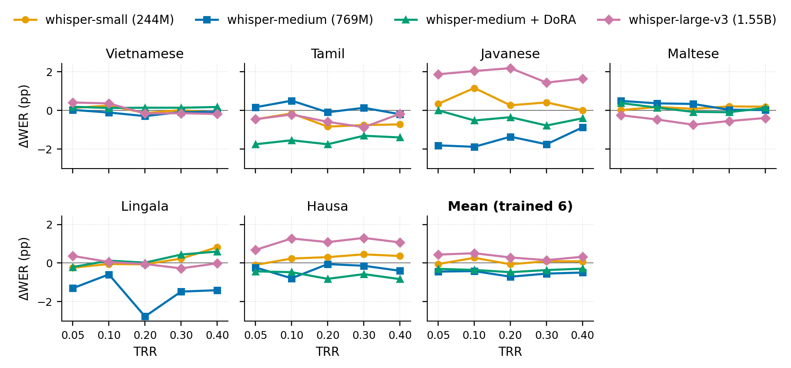

# Token Merging for Multilingual Speech Recognition

<p align="center">
  <a href="https://www.icnlsp.org/2026"></a>
  <a href="https://github.com/j31040116-boop/token-merging-multilingual-asr"></a>
  <a href="https://huggingface.co/dylan01163104/whisper-medium-dora-mix6"></a>
  <a href="LICENSE"></a>
</p>

<p align="center">
  <a href="https://www.ucla.edu"></a>
  &nbsp;&nbsp;&nbsp;&nbsp;
  <a href="https://www.icnlsp.org/2026"></a>
</p>

Code + frozen results for **"Token Merging for Multilingual Speech Recognition: A Systematic Study Across Model Scale and Fine-Tuning"** — Dylan Luke Holyoak. Oral at [ICNLSP 2026](https://www.icnlsp.org/2026welcome/).

We apply adjacent token merging (ToMe / A-ToMe) to the Whisper encoder across 3 model scales (small/medium/large-v3), 16 FLEURS languages, and composition with DoRA decoder fine-tuning. Merging shortens the encoder sequence at inference time without any retraining and costs essentially nothing on multilingual ASR — see the numbers below.

<p align="center"></p>

**Links**: 💻 [code](https://github.com/j31040116-boop/token-merging-multilingual-asr) · 🤗 [whisper-medium-dora-mix6](https://huggingface.co/dylan01163104/whisper-medium-dora-mix6) · 📊 [frozen result CSVs](tmm_asr/paper_results/) · 🖼 [paper figures](figures/)

## Headline results

Mean ΔWER (percentage points) at TRR = 0.40. "Worst degradation" is the largest positive ΔWER — the worst case for merging. Improvements (negative ΔWER) are shown separately.

| Setting | Model | Cohort | Mean ΔWER | Worst degradation | Largest improvement |
|---|---|---|---:|---:|---:|
| §5.1 Cross-lingual | whisper-medium | 12 mid/low-res langs¹ | −0.21 | +1.01 (Swahili) | −1.41 (Lingala) |
| §5.2 Cross-scale | whisper-small | 6 trained langs | +0.08 | +0.82 (Lingala) | −0.73 (Tamil) |
| §5.2 Cross-scale | whisper-medium | 6 trained langs | −0.50 | +0.02 (Maltese) | −1.41 (Lingala) |
| §5.2 Cross-scale | whisper-medium + DoRA | 6 trained langs | −0.29 | +0.59 (Lingala) | −1.41 (Tamil) |
| §5.2 Cross-scale | whisper-large-v3 | 6 trained langs | +0.32 | +1.65 (Javanese) | −0.40 (Maltese) |
| §5.3 Held-out generalisation | whisper-medium + DoRA | 10 unseen langs | +0.23 | +0.97 (Icelandic) | −0.08 (Thai) |
| §5.4 Theoretical enc. FLOPs | all 4 variants | @ TRR=0.40 | **24.3–25.1% reduction** | — | — |

Every number back-verified against the 12 frozen CSVs in [`tmm_asr/paper_results/`](tmm_asr/paper_results/). See [`manifest.json`](tmm_asr/paper_results/manifest.json) for the paper-claim → CSV mapping with sha256s.

¹ The §5.1 frozen CSV also contains 6 additional very-low-resource languages (am_et, pa_in, sn_zw, so_so, uz_uz, yo_ng) that were run in the same sweep but excluded from Table 2 / Figure 2 for cohort-consistency reasons. `fig2_lowres.py` filters to the plotted 12 automatically. Similarly, the high-resource anchor CSV contains cmn_hans_cn beyond the 4 plotted anchors. See [`manifest.json`](tmm_asr/paper_results/manifest.json) `langs_in_csv` vs `langs_plotted`, and [`docs/REPRODUCE.md`](docs/REPRODUCE.md) for the exact reproduction commands. These preserve a compatible schema, cohort, and row order; exact numerical differences should be reported rather than judged against a universal tolerance.

## Install

Python 3.11 or 3.12. Pick GPU or CPU depending on whether you plan to reproduce WER runs.

**GPU (CUDA 12.4, matches the paper env)**:
```bash
python -m venv .venv && source .venv/bin/activate
pip install -r requirements-gpu.txt
pip install -r requirements-common.txt
pip install -e .          # editable install of tmm_asr itself
```

**CPU-only** (figure regeneration + FLOP analysis + CPU unit tests only — no WER, no wall-clock):
```bash
python -m venv .venv && source .venv/bin/activate
pip install -r requirements-cpu.txt
pip install -r requirements-common.txt
pip install -e .
```

**As a library** (`pip install tmm-asr` from a wheel): all runtime deps except the CUDA-tagged torch wheel install automatically. If you want CUDA torch, install it separately from the PyTorch index first.

After any install path, `pip check` should print `No broken requirements found`.

Additional runtime env vars (all optional):
- `TMM_CACHE_DIR` — where the FLEURS pickle cache lives. Defaults to `$XDG_CACHE_HOME/tmm-asr/fleurs` or `~/.cache/tmm-asr/fleurs`. **Never** writes to the installed package.
- `TMM_CHECKPOINT_DIR` — where DoRA training writes checkpoints. Defaults to `./checkpoints/whisper-medium-dora-mix6` under the current working directory.
- `TMM_OUT_DIR` — where eval scripts drop CSVs. Defaults to `./outputs/eval/`.
- `TMM_GPU` — optional physical GPU selected by `scripts/reproduce_core_gpu.sh`.
- `TMM_PYTHON` — optional Python executable for that launcher; otherwise it
  uses `python` from the active environment.

## Reproduce

**Figures from frozen CSVs** — no GPU, ~5s each:

```bash
python -m tmm_asr.figures.fig1_layer_similarity   # Figure 1
python -m tmm_asr.figures.fig2_highres            # Figure 2 top
python -m tmm_asr.figures.fig2_lowres             # Figure 2 bottom
python -m tmm_asr.figures.fig3_cross_scale_ft     # Figure 3
python -m tmm_asr.eval.flops                      # §5.4 FLOP table
```

**WER numbers from scratch** — 1×GPU unless noted, 264 samples/lang, seed 42. **For the exact `--tag` recipes that match the frozen CSV filenames**, see [docs/REPRODUCE.md](docs/REPRODUCE.md) — the defaults below will produce valid data but different filenames.

The complete whisper-medium and whisper-small core reproduction can be run
sequentially on one GPU with `bash scripts/reproduce_core_gpu.sh`. It uses the
active Python environment, respects `CUDA_VISIBLE_DEVICES`, resumes compatible
partial CSVs, and writes persistent logs under `outputs/reproduction_full/`.

| Paper section | Command | Runtime |
|---|---|---|
| §5.1 Table 2 + Fig 2 (medium, 12 langs) | `python -m tmm_asr.eval.main_sweep --n 264 --tag single` → `..._halfplotted_single.csv` | ~9h* |
| §5.2 cross-scale small | see [REPRODUCE.md §3](docs/REPRODUCE.md) — needs `--tag mix16 --langs <16>` | ~3–6h* |
| §5.2 cross-scale large-v3 (dual-GPU) | `bash scripts/launch_large_v3_dual_gpu.sh && python scripts/merge_large_v3_shards.py` | ~9h wall-clock* |
| §5.3 DoRA + merge on 6 trained | `python -m tmm_asr.eval.ft_merge --n 264` | ~5h* |
| §5.3 ¶3 held-out 10 langs | `python -m tmm_asr.eval.ft_holdout --n 264` | ~6h* |
| Figure 1 (layer sim, 3 models) | `bash scripts/regenerate_layer_similarity.sh` | ~28min |
| DoRA training from scratch | `torchrun --standalone --nproc_per_node=2 -m tmm_asr.train.dora --steps 2000` | ~4h |
| Wall-clock benchmark (Limitations) | `python -m tmm_asr.eval.wallclock` | ~1h |

\*Measured/projection on the paper's RTX 3080 Ti environment; runtime varies
substantially with GPU, decoder output lengths, cache state, and language. The
combined frozen-cohort core run is approximately 16–19 hours on that setup.

`ft_merge` and `ft_holdout` load the DoRA adapter directly from [🤗 dylan01163104/whisper-medium-dora-mix6](https://huggingface.co/dylan01163104/whisper-medium-dora-mix6) by default. Pass `--checkpoint /path/to/local/checkpoint-2000` to override.

## Reproducibility guarantees

**Pinned exactly for evaluation**:

- whisper-small revision `973afd24…`
- whisper-medium revision `abdf7c39…`
- whisper-large-v3 revision `06f233fe…`
- FLEURS revision `d7c758a6…`
- Seed 42 in each executable evaluation script (`random`, `numpy`, `torch`, `cuda.manual_seed_all`)
- `cudnn.deterministic=True`, `cudnn.benchmark=False`
- `torch_dtype=torch.float32` (no fp16 nondeterminism)
- 34 direct runtime requirements, with the paper environment pinned in the split requirements files

**Expected drift on re-run**: Re-runs should preserve the frozen CSVs' schema, cohort, and row order. Exact WER values can vary slightly with GPU hardware, drivers, CUDA/cuBLAS versions, and discrete decoding decisions; compare re-run results against the frozen artifacts and report the observed differences rather than assuming a universal numerical tolerance. For stricter cuBLAS determinism, export `CUBLAS_WORKSPACE_CONFIG=:4096:8` before running.

**Not reproducible from this repo**: exact wall-clock latency numbers (§ Limitations) — those depend on the specific GPU and driver.

## What's here

```
tmm_asr/
├── merging.py            core token-merging module
├── eval/
│   ├── pipeline.py       shared pinned decode/preprocessing utilities (not a standalone CLI)
│   ├── main_sweep.py     §5.1 cross-lingual (Table 2, Fig 2)
│   ├── cross_scale.py    §5.2 cross-scale sweep
│   ├── ft_merge.py       §5.3 DoRA + merging composition
│   ├── ft_holdout.py     §5.3 ¶3 held-out generalisation
│   ├── layer_similarity.py Fig 1 forward-pass K-cosine profile
│   ├── flops.py          §5.4 theoretical FLOP derivation
│   └── wallclock.py      Limitations wall-clock benchmark
├── figures/              one script per paper figure
├── train/dora.py         DoRA fine-tuning (mix6 cohort)
└── data/                 FLEURS cache + 16-lang cohort table

tmm_asr/paper_results/    12 frozen CSVs + manifest.json (ships inside the wheel)
figures/                  the 4 paper figure PNGs
scripts/                  orchestration
tests/                    merging, resume, resolver, parity, and output-path tests
```

The technique in one sentence: head-mean K-cosine similarity → greedy non-overlapping pairing → intra-block placement between the attention residual and the FFN → applied at cascade `{2, 5, 8, 11, …}` with per-layer rates chosen so their compound TRR equals a global target.

## Developer setup

Install the dev extras (adds `pytest`, `ruff`, `build`):

```bash
pip install -e ".[dev]"
```

Run the tests (99 tests, ~12 s including 9 GPU-marked integration tests):

```bash
pytest -q                     # all tests (GPU classes skip if CUDA absent)
pytest -m "not gpu"           # CPU-only subset (unit tests + primitives)
pytest -m gpu                 # GPU integration only
```

The GPU integration tests load whisper-small (244M) and require ~1 GB of free VRAM. Marker registration lives in [`pytest.ini`](pytest.ini).

Optional system dependencies:
- `tmux` — used by `scripts/launch_large_v3_dual_gpu.sh` to run two GPU jobs in detached sessions. Not required for anything single-GPU.
- A modern NVIDIA driver (compatible with CUDA 12.4) — required for WER runs and the wall-clock benchmark. The pinned `torch==2.6.0+cu124` wheel already bundles the userspace CUDA libraries (libcudart, libcublas, libcudnn, etc.); you only need the driver, not a system-wide CUDA toolkit install.

Building a wheel:

```bash
python -m build
# → dist/tmm_asr-0.1.0-py3-none-any.whl
```

The wheel ships all runtime deps in its `install_requires`, plus the 12 frozen CSVs + `manifest.json` under `tmm_asr/paper_results/`. Figure and FLOP defaults work out of the box after `pip install tmm-asr` — no source checkout needed.

## Citation

```bibtex
@inproceedings{holyoak2026tokenmerging,
  title     = {Token Merging for Multilingual Speech Recognition:
               A Systematic Study Across Model Scale and Fine-Tuning},
  author    = {Holyoak, Dylan Luke},
  booktitle = {Proceedings of ICNLSP 2026},
  year      = {2026}
}
```

Machine-readable form in [`CITATION.cff`](CITATION.cff).

## License

Apache-2.0 — see [LICENSE](LICENSE). The Whisper checkpoints we build on carry their own upstream MIT license.
